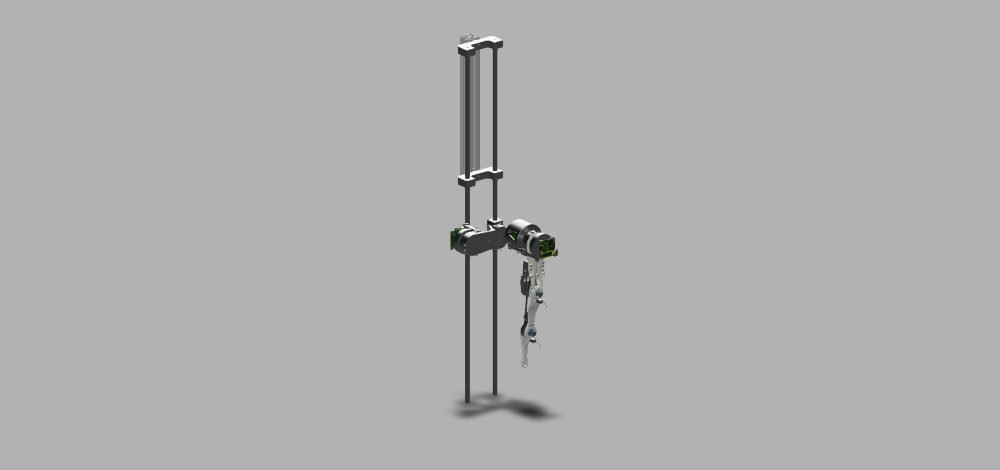
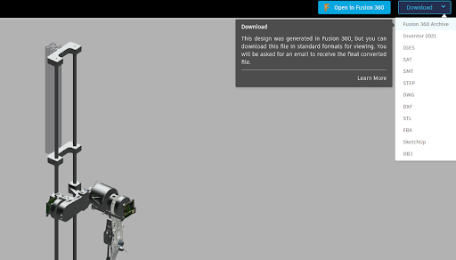

## Mechanical Design for Quadruped Robot Leg with Test-stand

All files for the teststand are available with the link to the [Fusion Assembly](https://a360.co/3btUFwj).

### Downloading project

The project files available in this repository. For latest development version, follow the download instructions:

- Open [online project link](https://a360.co/3btUFwj).   
- Chose the format to download (Fusion 360 Archieve is suggested)  
  
- Put email address to receive download link  
  
- The link is usually sent within 10 min  